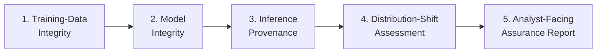
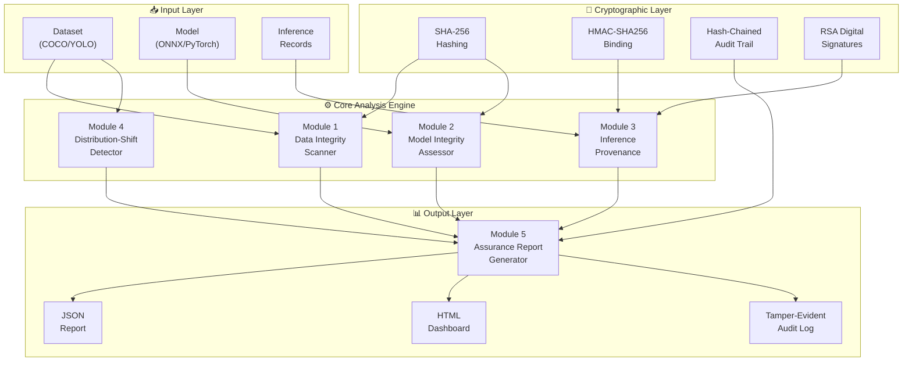
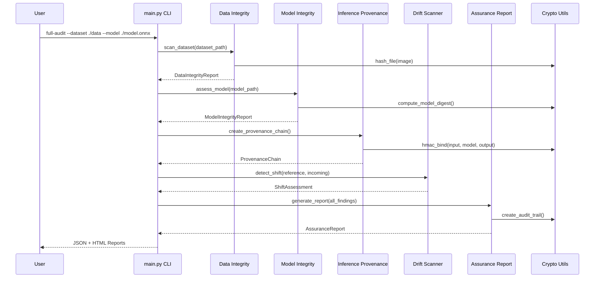
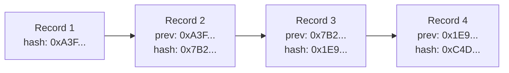
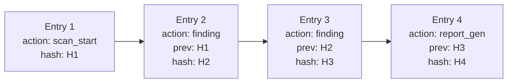

# 🛡️ Trustworthy Computer Vision Integrity Assurance Framework

## SIH 2025 — Problem Statement PS-228
### Theme: Blockchain & Cybersecurity

---

## 📋 Table of Contents

1. [Project Overview](#1-project-overview)
2. [Problem Statement Summary](#2-problem-statement-summary)
3. [Research Foundation](#3-research-foundation)
4. [System Architecture](#4-system-architecture)
5. [Core Modules](#5-core-modules)
6. [Technology Stack](#6-technology-stack)
7. [Installation & Setup](#7-installation--setup)
8. [Usage Guide](#8-usage-guide)
9. [Dataset & Model Support](#9-dataset--model-support)
10. [Security & Cryptographic Design](#10-security--cryptographic-design)
11. [Assurance Report Schema](#11-assurance-report-schema)
12. [Attack Coverage Matrix](#12-attack-coverage-matrix)
13. [Limitations & Known Constraints](#13-limitations--known-constraints)
14. [Demo Walkthrough](#14-demo-walkthrough)
15. [Future Enhancements](#15-future-enhancements)
16. [References](#16-references)

---

## 1. Project Overview

This project implements a **model-agnostic assurance system** for evaluating the integrity of training data, trained computer-vision models, and inference outputs in multi-contributor pipelines. It provides an evidence-based, unified assurance layer that operates **completely offline** in air-gapped environments.

> [!IMPORTANT]
> The entire framework operates without any cloud services or external APIs, making it suitable for deployment in sensitive, air-gapped environments.

### Key Objectives

- **Detect** poisoned, backdoored, or tampered training data
- **Assess** model integrity through behavioral and statistical analysis
- **Verify** inference provenance with cryptographic bindings
- **Monitor** distribution shifts and data anomalies
- **Report** findings with human-readable evidence and actionable recommendations

---

## 2. Problem Statement Summary

Operational computer vision pipelines combine data from **multiple contributors**, use **pretrained/vendor-supplied models**, and produce **inference outputs** consumed by downstream systems. This creates integrity risks across the entire lifecycle:

| Lifecycle Stage | Risk Type | Examples |
|---|---|---|
| **Training Data** | Poisoning & Manipulation | Trigger injection, label flipping, near-duplicate flooding, OOD insertion |
| **Model** | Substitution & Backdoors | Weight modification, hidden behaviors, model swapping |
| **Inference** | Tampering & Replay | Output replacement, record replay, post-hoc alteration |

### Five Core Capabilities Required



---

## 3. Research Foundation

This project is grounded in the research paper:

> **"Trust-Aware Data Pipelines for Verifiable AI Accelerators: A Data-Centric Framework"**
> Published in *International Journal of Engineering Research & Technology (IJERT)*, Vol. 14, Issue 06, June 2025
> ISSN: 2278-0181 | Paper ID: IJERTV14IS060187

### Key Concepts from the Paper

The research paper proposes a **6-stage trust-aware pipeline framework**:

| Stage | Purpose | Tools/Methods |
|---|---|---|
| **Data Ingestion** | Validate and version raw data | Checksums, signatures, DVC |
| **Lineage Tracking** | Maintain provenance metadata | OpenLineage, Apache Atlas, custom instrumentation |
| **Explainable Preprocessing** | Clean & transform data with audit trail | Pandas/NumPy, OpenCV, audit logging |
| **Conformance Verification** | Validate data-model alignment | Great Expectations, automated test suites |
| **Deployment Validation** | End-to-end testing on hardware | MLflow, CI/CD pipelines |
| **Continuous Monitoring** | Runtime anomaly detection | Real-time logging, performance tracking |

### How We Map the Paper to PS-228

| Paper Stage | PS-228 Module | Implementation |
|---|---|---|
| Data Ingestion + Lineage | Training-Data Integrity | Hash-based verification, contributor risk scoring |
| Conformance Verification | Model Integrity | Behavioral fingerprinting, weight statistics |
| Deployment Validation | Inference Provenance | Cryptographic binding chain |
| Continuous Monitoring | Distribution-Shift Assessment | Statistical tests, drift characterization |
| All Stages (Auditing) | Assurance Report | Tamper-evident audit trail, HTML/JSON reports |

---

## 4. System Architecture



### Component Interaction Flow



---

## 5. Core Modules

### Module 1: Training-Data Integrity (`core/data_integrity.py`)

**Purpose**: Identify suspicious or anomalous samples in the training dataset.

#### Detection Capabilities

| Attack Type | Detection Method | Confidence Level |
|---|---|---|
| **Trigger Injection** | Small-patch scanning, frequency analysis, anomaly in localized regions | High |
| **Label Flipping** | Statistical analysis of label distributions, cross-validation consistency | Medium-High |
| **Systematic Mislabelling** | Per-class error rate analysis, confusion pattern detection | Medium |
| **Near-Duplicate Flooding** | Perceptual hashing (pHash), hamming distance thresholds | High |
| **OOD Insertion** | Feature-space distance from class centroids, isolation forest | Medium |

#### Key Classes & Functions

```python
class DataIntegrityScanner:
    def scan_dataset(path: str, format: str) -> DataIntegrityReport
    def detect_triggers(images: List[np.ndarray]) -> List[Finding]
    def detect_label_anomalies(labels: Dict) -> List[Finding]
    def find_near_duplicates(images: List[np.ndarray], threshold: float) -> List[Finding]
    def detect_ood_samples(images: List[np.ndarray], reference: np.ndarray) -> List[Finding]
    def aggregate_by_source(findings: List[Finding], metadata: Dict) -> SourceRiskReport
```

#### Output Schema (per finding)

```json
{
    "sample_id": "img_00042.jpg",
    "finding_type": "trigger_injection",
    "severity": "CRITICAL",
    "confidence": 0.92,
    "evidence": "Detected 8x8 pixel patch at (224,224) with high-frequency anomaly score 0.87",
    "affected_asset": "training_dataset/batch_003",
    "recommendation": "QUARANTINE"
}
```

---

### Module 2: Model Integrity (`core/model_integrity.py`)

**Purpose**: Assess whether a supplied model exhibits anomalous, substituted, or backdoor-like behavior.

#### Access Modes

| Mode | Available Assessments | Requirements |
|---|---|---|
| **White-Box** | Weight statistics, layer analysis, activation patterns, behavioral fingerprinting | Full model weights access |
| **Black-Box** | Behavioral fingerprinting, trigger search via probing, output consistency | Inference-only access |

#### Assessment Methods

1. **Behavioral Fingerprinting**: Run standardized test battery, hash output signatures
2. **Weight Statistics Analysis**: Per-layer mean, std, sparsity, kurtosis detection
3. **Model Digest**: SHA-256 of serialized model weights for identity verification
4. **Anomaly Detection**: Flag layers with unusual weight distributions compared to architecture norms

```python
class ModelIntegrityAssessor:
    def assess_model(path: str, access_mode: str) -> ModelIntegrityReport
    def compute_behavioral_fingerprint(model, test_inputs) -> str
    def analyze_weight_statistics(model) -> List[LayerStats]
    def compute_model_digest(path: str) -> str
    def detect_backdoor_behavior(model, probe_inputs) -> List[Finding]
```

---

### Module 3: Inference Provenance (`core/inference_provenance.py`)

**Purpose**: Create verifiable cryptographic binding among input, model, config, and output.

#### Cryptographic Binding Structure

```
InferenceRecord = {
    record_id: UUID,
    timestamp: ISO-8601,
    nonce: random_bytes(16),
    input_hash: SHA256(input_image),
    model_digest: SHA256(model_weights),
    config_hash: SHA256(inference_config),
    output_hash: SHA256(inference_output),
    prev_record_hash: SHA256(previous_record),   // blockchain-style chaining
    binding_hmac: HMAC-SHA256(key, concat(all_above))
}
```



#### Tamper Detection Capabilities

- **Replay Attack**: Detected via nonce uniqueness and timestamp ordering
- **Substitution**: Detected via HMAC verification failure
- **Alteration**: Detected via hash chain integrity check
- **Deletion**: Detected via sequence gap detection

---

### Module 4: Distribution-Shift Assessment (`core/distribution_shift.py`)

**Purpose**: Detect material deviation from a declared reference distribution.

#### Shift Detection Methods

| Method | What It Detects | Statistical Test |
|---|---|---|
| **Pixel Intensity** | Brightness/contrast changes | KS Test, T-Test |
| **Color Histogram** | Color distribution shifts | Chi-Square, Earth Mover's Distance |
| **Edge Density** | Texture/detail changes | KS Test |
| **Feature Embedding** | Semantic drift | MMD (Maximum Mean Discrepancy) |

#### Shift Characterization

The system classifies detected shifts into categories:

- 🌤️ **Illumination** — lighting condition changes
- 📷 **Sensor** — camera/sensor hardware differences
- 🍂 **Seasonal** — environmental/temporal changes
- 🌍 **Terrain** — geographic/landscape differences
- ⚠️ **Suspicious** — patterns suggesting deliberate manipulation

```python
class DistributionShiftDetector:
    def compute_reference_profile(dataset: Dataset) -> ReferenceProfile
    def detect_shift(incoming: Dataset, reference: ReferenceProfile) -> ShiftAssessment
    def characterize_shift(metrics: Dict) -> ShiftType
    def compute_risk_score(shift: ShiftAssessment) -> float
```

---

### Module 5: Assurance Report (`core/assurance_report.py`)

**Purpose**: Generate structured assurance reports with tamper-evident audit trails.

#### Report Structure

```json
{
    "report_id": "uuid",
    "generated_at": "ISO-8601",
    "framework_version": "1.0.0",
    "summary": {
        "overall_risk": "MEDIUM",
        "total_findings": 15,
        "critical": 2,
        "high": 5,
        "medium": 6,
        "low": 2
    },
    "data_integrity": { "findings": [...] },
    "model_integrity": { "findings": [...] },
    "inference_provenance": { "findings": [...] },
    "distribution_shift": { "findings": [...] },
    "coverage_statement": {
        "supported_attacks": [...],
        "unsupported_attacks": [...],
        "assumptions": [...],
        "known_limitations": [...]
    },
    "audit_trail": {
        "entries": [...],
        "chain_integrity": "VALID"
    }
}
```

#### Finding Schema

Every finding across all modules follows a consistent schema:

| Field | Type | Description |
|---|---|---|
| `finding_id` | string | Unique identifier |
| `finding_type` | string | Category of the finding |
| `severity` | enum | CRITICAL / HIGH / MEDIUM / LOW / INFO |
| `confidence` | float | 0.0 – 1.0 confidence score |
| `reason` | string | Human-readable explanation |
| `evidence` | object | Supporting data and metrics |
| `affected_asset` | string | File, model, or record affected |
| `disposition` | enum | ACCEPT / REVIEW / QUARANTINE |

---

## 6. Technology Stack

| Category | Technology | Purpose |
|---|---|---|
| **Language** | Python 3.10+ | Core implementation |
| **Deep Learning** | PyTorch, TorchScript | Model loading, inference, training |
| **Model Interchange** | ONNX, ONNX Runtime | Cross-platform model support |
| **Computer Vision** | Pillow, OpenCV (optional) | Image processing |
| **ML Utilities** | scikit-learn, NumPy | Statistical analysis, anomaly detection |
| **Cryptography** | `hashlib`, `hmac`, `cryptography` | Hashing, signing, key management |
| **Reporting** | JSON, HTML (built-in) | Report generation |
| **CLI** | argparse | Command-line interface |
| **Testing** | unittest / pytest | Automated testing |

> [!NOTE]
> All dependencies are installable via pip and work completely offline once downloaded. No runtime cloud connectivity required.

---

## 7. Installation & Setup

### Prerequisites

- Python 3.10 or higher
- pip package manager
- (Optional) Virtual environment tool (venv, conda)

### Step-by-Step Installation

```bash
# 1. Clone or navigate to the project directory
cd D:\SIH_NEW

# 2. Create a virtual environment
python -m venv venv

# 3. Activate the virtual environment
# Windows:
venv\Scripts\activate
# Linux/Mac:
source venv/bin/activate

# 4. Install dependencies
pip install -r prototype/requirements.txt

# 5. Verify installation
python prototype/main.py --help
```

### Air-Gapped Installation

For air-gapped environments, pre-download all packages:

```bash
# On a connected machine:
pip download -r prototype/requirements.txt -d ./offline_packages/

# Transfer offline_packages/ to the air-gapped machine, then:
pip install --no-index --find-links=./offline_packages/ -r prototype/requirements.txt
```

---

## 8. Usage Guide

### CLI Commands

```bash
# Full audit (recommended — runs all checks)
python prototype/main.py full-audit \
    --dataset ./data/coco_dataset \
    --dataset-format coco \
    --model ./models/detector.onnx \
    --output ./reports/

# Scan training data only
python prototype/main.py scan-data \
    --dataset ./data/coco_dataset \
    --dataset-format coco

# Assess model integrity only
python prototype/main.py scan-model \
    --model ./models/detector.onnx \
    --access-mode white-box

# Verify inference chain
python prototype/main.py verify-inference \
    --chain ./inference_logs/chain.json

# Check for distribution shift
python prototype/main.py check-drift \
    --reference ./data/reference_profile.json \
    --incoming ./data/new_batch/
```

### Running the Demo (CLI)

```bash
# Generate synthetic demo data (includes poisoned samples)
python prototype/demo/generate_demo_data.py

# Run the full demo pipeline
python prototype/demo/run_demo.py
```

### 8.2 Interactive Web Dashboard

The framework includes a web UI designed for security analysts and auditors:

```bash
# Launch the web application
cd D:\SIH_NEW\prototype
python app.py
```

Open your browser at **`http://localhost:5000`** (or access from local network at `http://<LAN-IP>:5000`).

#### Web Features & Capabilities
- **Executive Security Dashboard**: Live telemetry stat cards (Total Scans, Threat Indicators Found, Models Verified, Reports Generated), animated metric counters, and an audit trail timeline.
- **One-Click Demo Generator**: "Run Demo" button triggers background generation of 50 multi-contributor CV samples with active trigger poisons, flipped labels, near-duplicate floods, and OOD samples.
- **Interactive Data Integrity Scanner**: Drag-and-drop COCO / YOLO dataset zone with multi-file upload, severity breakdown bars, and actionable row dispositions (Quarantine / Review / Accept).
- **Model Integrity Assessor**: White-box vs. Black-box toggle switch, SHA-256 model digest calculation, behavioral fingerprinting, and layer-by-layer weight sparsity diagnostics.
- **Inference Provenance Chain**: Interactive visual blockchain-style node graph depicting hashed inputs, model digests, inference outputs, and verifiable HMAC-SHA256 signatures with live chain integrity checks.
- **Distribution Shift Analyzer**: Dual-zone upload for Reference vs. Incoming image sets, dynamic SVG risk score gauge, shift classification (e.g. Illumination, Sensor Drift), and actionable mitigation recommendations.
- **Comprehensive Audit Stepper**: 5-step visual pipeline (Data -> Model -> Inference -> Drift -> Report) with live step indicators.
- **Assurance Report Hub**: Interactive table of generated audit reports with one-click direct download in JSON and styled HTML formats.

#### REST API Endpoints

| Method | Endpoint | Description |
|---|---|---|
| `GET` | `/api/stats` | Telemetry counts, threat metrics, and recent activity logs |
| `POST` | `/api/run-demo` | Generates 50 synthetic test samples, poisoned samples, and model |
| `POST` | `/api/scan-data` | Ingests COCO/YOLO dataset and executes Module 1 scans |
| `POST` | `/api/scan-model` | Assesses uploaded model or cached demo model |
| `POST` | `/api/inference/create` | Executes sample inference and appends cryptographic record |
| `GET` | `/api/inference/chain` | Retrieves the immutable audit chain for visualization |
| `POST` | `/api/inference/verify` | Verifies cryptographic integrity across all chained records |
| `POST` | `/api/check-drift` | Analyzes distribution shift between reference and incoming sets |
| `POST` | `/api/full-audit` | Sequentially executes all 5 modules and registers report |
| `GET` | `/api/reports` | Lists all generated assurance reports |
| `GET` | `/api/reports/<id>` | Retrieves report details and findings payload |
| `GET` | `/api/download-report/<id>/<fmt>` | Downloads report file (`json` or `html`) |

---


## 9. Dataset & Model Support

### Supported Dataset Formats

#### COCO Format
```
dataset/
├── images/
│   ├── img_0001.jpg
│   ├── img_0002.jpg
│   └── ...
└── annotations/
    └── instances.json    # COCO annotation format
```

#### YOLO Format
```
dataset/
├── images/
│   ├── img_0001.jpg
│   └── ...
└── labels/
    ├── img_0001.txt      # class_id cx cy w h (normalized)
    └── ...
```

### Supported Model Formats

| Format | Extension | Loading Method |
|---|---|---|
| PyTorch | `.pt`, `.pth` | `torch.load()` |
| TorchScript | `.pt` (scripted) | `torch.jit.load()` |
| ONNX | `.onnx` | `onnx.load()` + `onnxruntime` |

---

## 10. Security & Cryptographic Design

### Hash Chain (Tamper-Evident Audit Trail)



Each audit entry contains:
- `timestamp` — ISO-8601 creation time
- `action` — What was done
- `data` — Associated data/findings
- `prev_hash` — Hash of the previous entry
- `entry_hash` — SHA-256(timestamp + action + data + prev_hash)

**Any modification to any entry invalidates the entire chain from that point forward.**

### Inference Provenance Binding

```
binding = HMAC-SHA256(
    key = framework_secret_key,
    message = concat(
        input_image_hash,
        model_weight_digest,
        preprocessing_config_hash,
        inference_output_hash,
        timestamp,
        nonce,
        previous_record_hash
    )
)
```

> [!CAUTION]
> The HMAC key must be securely managed. In production, use a hardware security module (HSM) or secure enclave. The prototype uses a file-based key for demonstration purposes.

---

## 11. Assurance Report Schema

### Severity Levels

| Level | Color | Meaning | Action Required |
|---|---|---|---|
| **CRITICAL** | 🔴 | Confirmed attack or severe integrity breach | Immediate quarantine & investigation |
| **HIGH** | 🟠 | Strong indicators of compromise | Priority review within 24 hours |
| **MEDIUM** | 🟡 | Suspicious patterns requiring investigation | Scheduled review |
| **LOW** | 🔵 | Minor anomalies, likely benign | Monitor and log |
| **INFO** | ⚪ | Informational observations | No action required |

### Disposition Actions

| Disposition | Description |
|---|---|
| **ACCEPT** | Finding is informational or below risk threshold |
| **REVIEW** | Requires human analyst examination |
| **QUARANTINE** | Immediate isolation of affected asset |

---

## 12. Attack Coverage Matrix

### Supported Attack Classes ✅

| Attack Class | Module | Detection Method | Confidence |
|---|---|---|---|
| Trigger/Backdoor Injection | Data Integrity | Patch scanning, frequency analysis | High |
| Label Flipping | Data Integrity | Statistical distribution analysis | Medium-High |
| Near-Duplicate Flooding | Data Integrity | Perceptual hashing | High |
| OOD Sample Insertion | Data Integrity | Feature-space distance | Medium |
| Model Substitution | Model Integrity | Digest comparison, fingerprinting | High |
| Weight Tampering | Model Integrity | Statistical analysis | Medium |
| Inference Record Replay | Inference Provenance | Nonce/timestamp verification | High |
| Inference Record Alteration | Inference Provenance | HMAC verification | High |
| Distribution Shift | Drift Assessment | Statistical tests | Medium-High |

### Unsupported / Limited Attack Classes ⚠️

| Attack Class | Reason | Mitigation |
|---|---|---|
| **Adversarial Examples** | Requires model-specific adversarial detection | Future: integrate adversarial robustness testing |
| **Clean-Label Backdoors** | Extremely difficult to detect without retraining | Future: spectral signature analysis |
| **Gradient-Based Attacks** | Requires white-box access and training pipeline | Declare limitation in report |
| **Supply-Chain Compromise** | Beyond software scope (hardware/firmware) | Recommend hardware attestation |
| **Federated Poisoning** | Requires distributed training context | Out of scope for single-pipeline analysis |

---

## 13. Limitations & Known Constraints

> [!WARNING]
> These limitations must be clearly declared in every assurance report generated by the system.

1. **No Retraining Required**: The framework assesses models as-is. It does not retrain contributed models, which limits some backdoor detection techniques.

2. **Black-Box Limitations**: When only black-box access is available, weight-level analysis is unavailable. The system gracefully degrades and reports which assessments could not be performed.

3. **Dataset Size**: The prototype is optimized for datasets up to ~100K images. Larger datasets may require batched processing.

4. **Model Architecture Agnostic**: While the system is model-agnostic, some behavioral fingerprinting baselines may be more effective for certain architectures (CNNs vs. Transformers).

5. **Cryptographic Key Management**: The prototype uses file-based keys. Production deployments should use HSM or secure enclaves.

6. **Single-Pipeline Scope**: The system analyzes one pipeline at a time. Cross-pipeline correlation (e.g., comparing contributor behavior across multiple projects) is not supported.

---

## 14. Demo Walkthrough

### Step 1: Generate Demo Data

```bash
python prototype/demo/generate_demo_data.py
```

This creates:
- 50 synthetic images (32×32 RGB) across 5 classes
- 5 **poisoned samples** with trigger patches (small white squares)
- 5 **label-flipped** samples
- 3 **near-duplicate** images
- 2 **out-of-distribution** samples (noise images)
- A trained tiny CNN saved as `.pt` and `.onnx`

### Step 2: Run Full Audit

```bash
python prototype/demo/run_demo.py
```

### Expected Output

```
============================================================
  TRUSTWORTHY CV INTEGRITY ASSURANCE FRAMEWORK — DEMO
============================================================

[1/4] Scanning training data integrity...
  ✓ Found 5 trigger-injected samples (CRITICAL)
  ✓ Found 5 label-flipped samples (HIGH)
  ✓ Found 3 near-duplicate clusters (MEDIUM)
  ✓ Found 2 OOD samples (HIGH)

[2/4] Assessing model integrity...
  ✓ Model digest: sha256:a3f7c2...
  ✓ Behavioral fingerprint: bf:9e2d1a...
  ✓ Weight statistics: 3 layers analyzed, 0 anomalies

[3/4] Verifying inference provenance...
  ✓ Created 10 inference records
  ✓ Chain integrity: VALID
  ✓ No replay/tampering detected

[4/4] Checking distribution shift...
  ✓ Reference profile computed
  ✓ Shift detected: MODERATE (illumination-type)
  ✓ Risk score: 0.45

============================================================
  ASSURANCE REPORT GENERATED
  → JSON: ./reports/assurance_report.json
  → HTML: ./reports/assurance_report.html
  → Audit: ./reports/audit_trail.json
============================================================
```

---

## 15. Future Enhancements

| Enhancement | Priority | Description |
|---|---|---|
| **Blockchain Audit Trail** | High | Replace hash-chained log with a local blockchain (e.g., HyperLedger) for distributed trust |
| **Adversarial Robustness Testing** | High | Integrate FGSM/PGD attack simulation for adversarial example detection |
| **Spectral Signature Analysis** | Medium | Detect clean-label backdoors via spectral analysis of feature representations |
| **SHAP/LIME Explanations** | Medium | Add model explainability for flagged inference outputs |
| **Web Dashboard** | Low | Interactive Streamlit/Gradio dashboard for real-time monitoring |
| **Multi-Pipeline Correlation** | Low | Cross-pipeline contributor behavior analysis |
| **Hardware Attestation** | Future | TPM-based attestation for hardware integrity verification |

---

## 16. References

1. Soni, A.A. et al. "Edge Vs Cloud Computing Performance Trade-Offs for Real-Time Analytics," *IJSEA*, vol. 14, no. 06, 2025.
2. Nelson, J.; Soni, A.A. "Model-Driven Engineering Approaches to the Verification of AI Accelerators," 2023.
3. ISO/IEC 22989:2022, "Artificial Intelligence Concepts and Terminology."
4. Nelson, J.; Soni, A.A. "Co-Verification of Hardware-Software Co-Design in Machine Learning Accelerators," 2023.
5. NIST, "A Taxonomy and Terminology of Adversarial Machine Learning," NISTIR 8269, 2020.
6. Soni, A.A.; Soni, J.A. "Trust-Aware Data Pipelines for Verifiable AI Accelerators: A Data-Centric Framework," *IJERT*, vol. 14, no. 06, 2025.
7. Amershi, S. et al. "Software Engineering for Machine Learning: A Case Study," *ICSE-SEIP*, 2019.
8. Schelter, S. et al. "Automatically Tracking Metadata and Provenance of Machine Learning Experiments," *ICDE*, 2017.
9. Hazarika, A.V.; Shah, M. "Blockchain-based Distributed AI Models: Trust in AI Model Sharing," *IJSRA*, 2024.
10. NIST TrojAI Benchmark, BackdoorBench — Public backdoor/adversarial ML resources.

---

> **Project Framework**: SIH 2025 PS-228 | **Theme**: Blockchain & Cybersecurity
> **Status**: Prototype v1.0 | **Environment**: Offline / Air-Gapped Compatible
